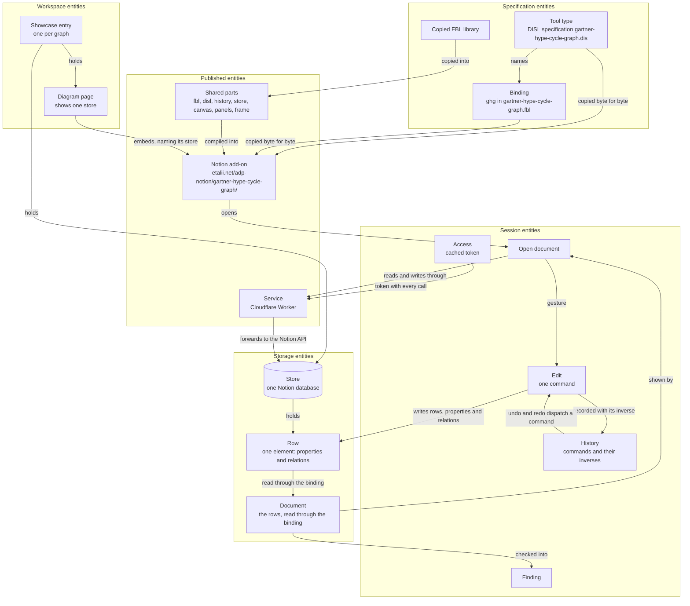

# Data Model: The Gartner Hype Cycle Graph as a Notion Add-on

**Feature**: [notion-hype-cycle-addon.spec.md](notion-hype-cycle-addon.spec.md) | **Plan**: [plan.md](plan.md) | **Research**: [research.md](research.md)

This feature defines no file format and changes none. The format of a graph is the FBL binding `gartner-hype-cycle-graph.fbl#ghg`, and the tool type is the DISL specification `definitions/diagrams/gartner-hype-cycle-graph.dis`; both are read, neither is restated (FR-002, FR-003). What the feature adds is a second place for the same document to live, a Notion database, and the parts that carry it there and back.

Its entities are of five kinds. The **specification entities** are what the add-on is given and does not own. The **storage entities** are the database, its rows and the document they make. The **session entities** are what exists only while a page is open: the access a person granted, the open document, its edits, its history and its findings. The **published entities** are the add-on, its shared parts and the service. The **workspace entities** are the pages of the Notion workspace that show a graph.

The words tool, tool type, host and Notion add-on keep the meaning [docs/terminology.md](../../docs/terminology.md) gives them. **Store** is new: it is added to the glossary before any file uses it (spec, Assumptions; plan, Constitution Check). `FR-`, `NFR-` and `SC-` numbers are those of the spec; `D` and `R` numbers are the decisions and risks of the research. Where a detail is fixed by a contract, the contract is named and is not repeated here.

## Overview



## Specification entities

These are inputs. This feature owns none of them and changes 0 lines of the first two (SC-008).

### Tool type

The Gartner hype cycle graph.

| Field | Value |
| --- | --- |
| origin | `gartner/hypecycle-graph` |
| language id | `net.etalii.adp.gartner.hypecycle-graph` |
| display name | "Gartner hype cycle graph" (the specification's `language.label`) |
| DISL specification | `definitions/diagrams/gartner-hype-cycle-graph.dis` in `etalii.adp`, DISL `0.3`, conformance `standard` |
| required features | twelve, listed in the research under "What exists" |
| persistence | the FBL binding `gartner-hype-cycle-graph.fbl#ghg`, in `etalii.adp.ide.standalone` |

**Rules**

- The add-on **MUST** honour the whole definition of the tool type as the DISL specification and the FBL binding state it: every section of the specification and every rule of the binding, not a chosen part. That is the elements and relations, the time axis and its ruler, the phases, the toolbox, the menus, the forms, the constraints and their sentences (FR-002), and equally everything else the two files say.
- Nothing the two files state is left out, approximated or replaced by a choice of the add-on's own. For this tool type the list of what the interpreter does not support is empty: the finding for an unsupported feature (FR-005) is for another add-on's specification, never for this one. What the specification itself leaves unstated is another matter: the four behaviours listed at the end of the research follow an interim rule of the shared parts, and `docs/disl-support.md` lists them.
- A difference between them and what Notion needs is raised as a change in `etalii.adp` and settled nowhere in the add-on (FR-003). The differences found so far are listed at the end of the research.
- The display name is the one spelling used for pages and databases (FR-030).

### Binding

`ghg`, FBL `0.1`: body kind `file`, family `yaml`. It is the one description of what a graph holds. The table is a reading aid for this document; code **MUST NOT** carry it (FR-004).

| Element rule | Type | Place | Keys the rule reads | On removal |
| --- | --- | --- | --- | --- |
| `graph` | Graph | `/` | `gartner-hypecycle-graph` (the header, value `1`) | read-only |
| `unit` | Unit | `/unit` | the entry's own value | read-only |
| `trend` | Trend | `/trends/*` | `id`, `name`, `start`, `stop`, `row`, `phases`, `peak-end`, `trough-end`, `slope-end`, `tags`, `description` | cascades to `influence` |
| `trigger` | Trigger | `/triggers/*` | `id`, `name`, `date`, `row`, `tags`, `description` | cascades to `influence` |
| `note` | Note | `/notes/*` | `id`, `text`, `at`, `row`, `width`, `height` | nothing else |
| `influence` | Influence | `/influences/*` | `id`, `from`, `from-phase`, `from-edge`, `from-at`, `to`, `to-phase`, `to-edge`, `to-at`, `description` | nothing else |
| four `*-not-a-mapping` rules | Unreadable | the four lists | none | read-only |

**Relationships**: an influence's `from` and `to` are references by stored id to a trend or a trigger. The binding keeps an influence whose end names nothing, and the specification reports it; it is not dropped.

**Rules**

- A key marked `empty: refuse` (a trend's or trigger's `name`) refuses an empty value; one marked `empty: remove` leaves the document when emptied; a note's `text` is kept when empty. These come from the binding and reach the store through the FBL library, never through code of the store's own (D3).
- The header and the unit are read-only in the binding ("changed in the file itself"). A store has no file, so the unit is changed in the database's own table; this is raised in `etalii.adp` (research, Differences).
- The four `*-not-a-mapping` rules and each rule's `unknownKeys` cannot arise from a store, because a row is always a mapping of known properties (D2).

### Copied specification and binding

The two files in the add-on's folder, `gartner-hype-cycle-graph.dis` and `gartner-hype-cycle-graph.fbl`.

| Field | Meaning |
| --- | --- |
| source repository | `etalii.adp` for the `.dis`; the repository its `persistence.binding` names for the binding |
| source commit | the commit each file was copied at |
| SHA-256 | of each file as copied |
| record | `PROVENANCE.md` in the same folder |

**Rules**

- A copy is byte for byte and is never edited in the Notion repository; `Build` fails when a file differs from its record (D6).
- The page loads both at run time by relative address, so a changed specification is a new copy and no change to code (Story 1, scenario 6).

### Copied FBL library

`src/fbl/` in `etalii.adp.ide.notion`: the Visual Studio Code host's `src/core/fbl`.

| Field | Meaning |
| --- | --- |
| source | `etalii.adp.ide.vscode`, `src/core/fbl`, at a recorded commit |
| SHA-256 | one per file, in `src/fbl/PROVENANCE.md` |
| gives | reading a body through a binding, each change as splices, a history with exact undo and drift refusal |

**Rules**

- It is never edited here; a correction goes to the Visual Studio Code host's repository (D4).
- The add-on imports the modules it needs, not the library's index (D4).

## Storage entities

### Store

The Notion database that holds one graph. It is the graph's only store.

| Field | Meaning |
| --- | --- |
| database id | Notion's id of the database; the value of `store` in the embed address |
| title | `<graph name> - Data` |
| properties | the store's schema, below |
| rows | the graph's elements |
| prepared | whether the database has every property the binding asks for |

**Relationships**: holds one graph; named by one or more diagram pages; belongs to one Showcase entry.

**Rules**

- A graph's document is kept in its store, that is, as the rows of the database, the properties of those rows and the relations between them, and in nothing else. The add-on keeps no second copy on a server or in the browser that outlives the page (FR-006).
- No two graphs share a store (Story 4, scenario 3; spec, Assumptions).
- A store may be embedded in two pages. Each open page is then a separate session, and FR-022 holds between them as between two people.
- A database that lacks a property the binding asks for is **unprepared**. `scripts/store.mjs put` adds what is missing, and the add-on offers the same step to a user who opens such a database (D14). A reader who may not edit sees a sentence that says so, not a failure.
- An empty, prepared store is an empty graph and reports nothing (Story 1, scenario 5).

### Store schema

The properties of a store. They are derived from the binding by `src/store/schema.ts`; the exact names and Notion property types are in [contracts/store.md](contracts/store.md).

| Property | Kind of value | Holds |
| --- | --- | --- |
| the title property, named after the binding's id key (`id`; the first database's `Name` is renamed when the store is prepared) | title | The element's identity: its stored id |
| `Kind` | one of a fixed set | The element's type: the name of the binding's element rule the row belongs to (`trend`, `trigger`, `note`, `influence` or `unit`), and through that rule the type the specification's metamodel gives it (Trend, Trigger, Note, Influence, Unit) |
| `Order` | number | The row's place among the rows of its kind |
| one property per key of the binding that reads a plain value | text, number or checkbox, by the attribute's type | The value of that key for the row's element; empty when the element has no such key or the kind does not read it |
| one property per key whose attribute is an enum | one of a fixed set, the enum's values | The stored value, such as an influence's `from-phase` and `from-edge` or the unit's `unit` |
| one property per key whose attribute holds many values | several of a set | The values, such as `tags` |
| one property per key whose attribute is a reference | relation, to rows of the same database | The element the reference names, such as an influence's `from` and `to`: the row of a trend or a trigger |

**Rules**

- Each attribute the binding reads **MUST** be a property of the database, so that a reader sorts and filters the elements in Notion (FR-007).
- The type of an element is a property (`Kind`), and so is every attribute that says what sort of thing a value is: an enum is a property of fixed options, never free text.
- A relation between two elements **MUST** be a Notion relation between their two rows, so that a reader follows it in Notion and the database holds the whole graph, relations included. What the binding reads as the reference's value is the stored id of the related row.
- A relation property holds at most one row for a reference to one element. More than one, or a row of a kind the reference does not allow, is a finding.
- An end that names nothing is an empty relation: the element is kept and the specification reports it, as the binding asks. The id such an end named in a document cannot be kept, and `scripts/store.mjs put` reports it.
- A key that several rules read, such as `id`, `row`, `tags` or `description`, is one property, used by every kind that reads it.
- The schema is computed from a binding and names no key itself (FR-004, FR-028). A second add-on gets its schema from its own binding.
- The store keeps no property for document text: comments, the order of keys, keys the binding does not read and entries that are not a mapping are not kept (FR-007, D2).
- A property the schema does not know, added by a reader in Notion, is left alone: it is neither read nor written nor removed.

### Row

One page of the database: one element of the graph.

| Field | Meaning |
| --- | --- |
| row id | Notion's id of the page; how the store finds the row again |
| kind | the value of `Kind` |
| order | the value of `Order` |
| values | the properties that carry the element's keys |
| relations | the relation properties that carry the element's references, each to another row of the store |
| last edited | Notion's time of the last change, and who made it |

**Relationships**: belongs to one store; is one element of the document; an influence's row is related to the row of the trend or trigger at each of its ends, through the relation properties of the store schema.

**Rules**

- A graph is one row per trend, trigger, note and influence, and one row for the unit when the graph has one (FR-007, D2). The header has no row: it comes from the binding's template.
- At most one row has the kind `unit`. A second is a finding and is not drawn.
- The order of the elements of one kind is the order of their `Order` values. Taking a document out gives its elements in the order they were put in (SC-003).
- A row whose kind no rule of the binding has, or whose values the binding cannot read, is a finding and the rest is drawn (FR-013; Story 1, scenario 3). Reading a row never fails.
- An element's identity is its stored id (`id`). A row id is the store's own and is in no document: a relation holds row ids in Notion and is read as the stored ids of those rows.
- A row removed by an edit is put in Notion's trash, so an undo can bring the same element back with the same values and the same relations (SC-005). An undo takes that same row out of the trash, so its row id survives ([contracts/store.md](contracts/store.md)).
- A query returns at most 100 rows, so a store is read in pages; a store is read whole before anything is drawn (R1).

### Document

The graph as the binding describes it. In Notion the document is the database: below the binding, the rows of the store are the single source of truth, where another host has a file.

| Field | Meaning |
| --- | --- |
| elements | what the binding reads from the rows: one element per row, typed by its `Kind`, with the values of its properties |
| relations | what the binding reads from the relation properties: each reference of an element, to the element of the related row |
| unit | the value of the one row of the kind `unit`, or the binding's default when there is none |

**Relationships**: is the rows of one store; read through the binding into the elements and relations the interpreter draws; changed by edits, each as writes to rows.

**Rules**

- The binding says what a graph holds, and the rows hold it. There is no stored document text and no second document: what an open page has in memory, the elements and the body the FBL library plans splices against, is a reading of the rows, never a source, and it is replaced whenever the rows are read again (FR-006).
- A document taken from a host, stored, edited in no way and taken out again reads the same in that host: the same elements in the same order with the same attributes and the same relations, but for the id of a reference that names nothing (FR-007). Its bytes may differ (SC-003). Text in the binding's format leaves the page's memory nowhere; it is written out only by `scripts/store.mjs take`, into a file.
- A document that cannot be read at all opens empty and read-only, with the sentence "The graph could not be read, so it cannot be edited." (FR-013; Story 1, scenario 4).

## Session entities

Nothing here outlives the page, except the access token and which panels are collapsed.

### Access

What a person granted the add-on in Notion.

| Field | Meaning |
| --- | --- |
| token | the person's access token for the Notion integration |
| expires | when the token stops being valid, where Notion says so |
| kept in | the browser's storage for the add-on's origin, for as long as the token is valid |
| reach | the pages and databases the person shared with the integration |
| rights | reading, or reading and writing |

**Rules**

- The add-on reads and writes with the rights of the person looking at the page, or with rights that person granted, once (FR-010).
- No published page holds a secret. The client secret of the integration is known to the service alone (FR-010, SC-010).
- A token is requested only when it is needed: when a call to Notion is about to be made and no valid token is cached. A page that makes no call, such as the set-up help, requests none.
- A token, once given, is cached for as long as possible and used for every call, every store and every visit until it expires. It is never requested again while the cached one is valid.
- A new token is requested only when the cached one has expired, or Notion refuses it. Where Notion lets a token be renewed without the person, it is renewed so; the person is asked to grant access again only when it cannot be.
- The token and the collapsed state of the panels are the only things the add-on keeps between visits; no document is (FR-006).
- A person whose grant allows reading only, or whose write Notion refuses, gets a read-only diagram with no editing control, from the opening where Notion says so then and otherwise from the first refused write (FR-021).
- A person with no token, or whose token does not reach the store, sees the invitation to connect and no diagram (R3).

#### State transitions: access

```text
no token ──a call needs one, person grants access──> connected ──store not shared with the integration──> invited to share
    ▲                                                    │
    │ token expired, or refused by Notion,               ├── grant allows reading only, or a write is refused ──> read-only
    │ and it cannot be renewed without the person        │
    └────────────────────────────────────────────────────┤
                                                         └── grant allows writing ──> editing

cached token, still valid ──page opened, nothing requested──> connected
connected ──token expired, renewed without the person──> connected
```

### Open document

One store opened in one page.

| Field | Meaning |
| --- | --- |
| store | the database id the embed address names |
| state | see the transitions below |
| last read | the time of the newest row edit the page has seen |
| pending writes | the row writes not yet answered by Notion |
| selection | the elements the user selected |
| viewpoint and panels | what is shown, and whether each panel is collapsed; the collapsed state is also kept in the browser's local storage, see "Toolbox and property grid" |

**Rules**

- Without `store` in the address, the page shows how to set a graph up and reads nothing (D11; edge case "no database to read").
- The diagram is drawn the same as in the standalone and Visual Studio Code hosts: the same elements, names, places on the time ruler, phases and influences (FR-012, SC-001).
- A graph of 50 trends is drawn within 3 seconds of opening its page (SC-002). The largest example, 518 rows, will not make that (R1).
- Loading, storing and a lost connection are shown in the manner Notion does, and never block the page around the embed (NFR-008).
- Before a write, and when the page regains the focus, the store asks the database for rows edited since the last read. A row changed by somebody else stops the write (FR-022, D10).

#### State transitions: an open document

```text
(no store in address) ──> set-up help

loading ──cannot be read at all──> empty, read-only            ("The graph could not be read, so it cannot be edited.")
   │
   ├──read, person may not write──> open, read-only            (no editing control)
   │
   └──read, person may write──> open, editing
                                   │  edit, undo or redo
                                   ▼
                                storing ──every write answered──> open, editing
                                   │
                                   ├──rows changed by somebody else──┐
                                   ├──a write fails──────────────────┤
                                   └──connection lost────────────────┤
                                                                     ▼
                              user told ──> reloading ──> open, editing, history empty
```

### Edit

One change a user makes: one gesture, one command, one entry of the history, and the row writes it comes to.

| Field | Meaning |
| --- | --- |
| gesture | what the user did: a drop from the toolbox, a drag, a change in the property grid, a rename, a removal, a context action |
| command | the change as data: what is to happen, not how. See "History" |
| splices | the change as the FBL library plans it through the binding: entries inserted, entries removed, values of keys changed |
| inverse | the command that undoes it, with the splices that do so |
| row writes | what each splice comes to in the database: the specific rows it touches and, on each, the specific properties and relations |

**Rules**

- A splice lands on named rows and properties, and on nothing else. An inserted entry is one row created with its properties and relations; a removed entry is one row put in the trash; a changed value of a key is that key's one property on the element's one row; a changed reference is that key's relation property; a changed place among the entries of a list is the `Order` of the rows that moved.
- Which rows and properties a splice lands on is found from the binding alone: the splice's place gives the element rule and so the `Kind`, the entry gives the row, and the key gives the property. No code names a kind, a key or a property to find them (FR-004). The exact resolution is fixed in [contracts/store.md](contracts/store.md).
- A splice that lands on no row or property of the store, such as one that changes only how a value is written, writes nothing. An edit one of whose splices cannot be resolved is not applied at all: it is never written in part.
- An edit writes the rows and properties its splices land on and no other. The rows are not read back and compared to find out what changed.
- Every edit the specification offers can be made: the list of its toolbox items, gestures and context actions has 0 items that cannot be done (FR-015, SC-006).
- A gesture the user experiences as one action is one edit, however many attributes or elements it changes. Removing a trend removes its influences in the same edit (FR-024; the binding's cascade).
- An edit the specification or the binding refuses changes nothing and shows that refusal's sentence (FR-019).
- A completed edit is stored without a save action (FR-018). It is on the canvas within 100 milliseconds and in the database within 5 seconds (SC-004); an edit that moves many elements takes longer to store, with its progress shown (R2).
- An edit that cannot be stored is reported, and the diagram then shows what the database holds. No change is silently lost (FR-020; Story 2, scenario 7).
- The writes of one edit are sent in the order of its splices. When one fails after others were stored, nothing later is sent, the stored writes are not taken back, and the user is told that the edit was stored in part; the store is then read again (FR-020).
- An undo or a redo made while writes are queued joins the queue behind them. While writes are queued the page asks the browser to warn before it is left; writes not sent when it closes are not stored.

#### State transitions: an edit

```text
attempted ──refused by specification or binding──> nothing changed, sentence shown
    │
    ▼
command dispatched: splices planned, each resolved to its rows and properties, canvas redrawn, command and inverse added to the history
    │
    ▼
row writes queued ──all answered──> stored
    │
    └──drift found, or a write fails──> not stored: user told, store read again, history cleared
```

### History

The undo history of one open document. Notion offers an embedded page no part in its own undo, so the add-on keeps its own (FR-026), and it is command based, as the standalone application's is (`EtAlii.Adp.History`).

| Part | Meaning |
| --- | --- |
| command | an intent to change the document, as plain data that cannot change: what is to happen, never how. It holds no live state, so the same command can be run again |
| handler | carries out the commands of one type, exactly one handler per type. It checks its own preconditions each time it runs, and reports the result with the inverse command |
| dispatcher | finds the handler of a command and runs it. Dispatching alone records nothing |
| history entry | a command paired with its inverse |
| history stack | runs commands and keeps the entries of those that report an inverse; says whether there is something to undo and to redo, and tells its listeners when that changes |

| Field | Meaning |
| --- | --- |
| undo entries | the entries of the edits made since the page was opened or last reloaded, newest last |
| redo entries | the entries of the edits undone and not yet overtaken |

**Rules**

- Every change to a document goes through the history stack as a command. An undo dispatches the entry's inverse and a redo dispatches its command again: both are ordinary dispatches, with no second way of applying a change.
- A command that is refused, or that changes nothing, reports no inverse and is not recorded.
- The history is a shared part of its own, `history`, built as the FBL library, the interpreter, the canvas and the panels are: it names no tool type, knows neither Notion nor the store, and is usable by another add-on without change (FR-028). The store brings the handlers; the history only dispatches and records.
- It follows the other hosts where they already have the part: the commands, handlers, dispatcher, entries and stack are those of the standalone application's `EtAlii.Adp.History`, and it sits beside the other shared parts as `src/core/fbl` and `src/core/diagram` sit apart from the host's own code in the Visual Studio Code host.
- Should Notion come to offer an add-on a part in its own undo, the same commands are handed to it; the handlers do not change (FR-026).
- CTRL+Z undoes the last edit and CTRL+Y redoes the last undone edit, on the canvas and in the database, while the diagram has the keyboard focus. On macOS the platform's own keys work as well (FR-023).
- Undo and redo are also reachable without a keyboard, through two controls (FR-025).
- An undo or a redo is itself a command, stored as row writes with the same checks as an edit (FR-026, D9).
- A new edit after an undo empties the redo entries (Story 3, scenario 4).
- With nothing to undo or redo, the key changes nothing (Story 3, scenario 5). The history starts empty when the page opens, so nothing before that can be undone.
- The history is cleared when the store is read again after drift or a failed write, so an edit is never undone on top of somebody else's change (D10).
- After any sequence of 20 edits, 20 undos leave the database identical to its state before the first (SC-005).
- The history ends when the page is closed (D9).

#### State transitions: the history

| Event | Undo entries | Redo entries |
| --- | --- | --- |
| page opened, or store read again | emptied | emptied |
| edit stored | gains the edit | emptied |
| undo | loses its newest entry | gains it |
| redo | gains the entry | loses its newest entry |
| undo or redo with nothing to take | unchanged | unchanged |

### Finding

The result of a constraint of the specification, of reading, or of loading the specification.

| Field | Meaning |
| --- | --- |
| severity | as the specification gives it |
| sentence | the specification's or the binding's own |
| place | the element it concerns, or the row when no element could be read |
| source | a constraint, an unreadable row, or a feature the interpreter does not support |

**Rules**

- A finding is shown with its severity, its sentence and the element it concerns (FR-014; Story 2, scenario 6).
- A finding never stops the rest from being drawn (FR-013).
- A feature a specification requires and the interpreter does not support is a finding on loading, and is listed in `docs/disl-support.md` (FR-005, D5).
- Findings are computed, never stored: a store has no property for them.

## Published entities

### Notion add-on

The page that shows the Gartner hype cycle graph inside a Notion page.

| Field | Value |
| --- | --- |
| id | `gartner-hype-cycle-graph`, the name of the specification's file (D11) |
| address | `https://etalii.net/adp-notion/gartner-hype-cycle-graph/` |
| `store` | the database id; which graph to show (FR-009) |
| `theme` | `light` or `dark`; overrides the system setting (D13) |
| folder | `addons/gartner-hype-cycle-graph/`: `index.html`, `addon.json`, the two copied files, `PROVENANCE.md` |

**Relationships**: one add-on, one tool type, one address; listed once in the index at `/adp-notion`; serves any number of stores.

**Rules**

- It is published in its own folder under `https://etalii.net/adp-notion`, at an address the index lists (FR-001).
- It is shown through an embed block and is usable at the width and height the block is given; no page it serves refuses to be framed (FR-011).
- It follows the light and the dark appearance wherever it can tell which the reader uses (NFR-003).
- Its folder holds what is particular to it and nothing else; everything shared is compiled in from `src/` (FR-028, D12). The embed address is fixed in [contracts/addon-address.md](contracts/addon-address.md).

### Add-on declaration

`addon.json` in an add-on's folder.

| Field | Meaning |
| --- | --- |
| specification | the file name of the copied DISL specification, and where it is copied from |
| binding | the file name of the copied FBL binding |

**Rules**

- It names files and sources only. It **MUST NOT** restate anything the specification or the binding says.
- A second add-on is a folder with a page, a declaration and its copied specification (plan, Structure Decision).

### Shared part

A part of `src/` in `etalii.adp.ide.notion`, compiled into every add-on.

| Part | Gives |
| --- | --- |
| `fbl` | the copied FBL library |
| `disl` | the interpreter of a DISL specification, one module per section |
| `history` | commands, their handlers' contract, the dispatcher and the history stack: undo and redo for any document |
| `store` | a document as rows of a Notion database: schema, rows, relations, calls, session, open document, and the handlers of its commands |
| `canvas` | drawing and gestures from the interpreted notation |
| `panels` | the toolbox, the property grid, their controls and their styling, and the collapsed state of each panel |
| `frame` | what wires the parts: keys, status, findings |

**Rules**

- No shared part names an element, attribute or rule of the Gartner hype cycle graph; `test/words.test.ts` fails when a file under `src/` does (FR-004; Story 5, scenario 3).
- The toolbox and the property grid are usable by another add-on without change, drawing their content from that add-on's specification: 0 lines changed (FR-027, SC-007).
- The interpreter, the store and the history are likewise usable by another add-on (FR-028), and so is every part of drawing the diagram that does not depend on one tool type: shapes, connectors, geometry, layout, the ruler and the gestures belong to `canvas`, not to an add-on. What a second add-on codes against is in [contracts/shared-parts.md](contracts/shared-parts.md).

### Toolbox and property grid

The two panels.

| Panel | Content | Source |
| --- | --- | --- |
| toolbox | the toolbox items, each with name, icon and description | the specification's toolbox |
| property grid | the attributes of the selection, each with the control its form asks for | the specification's forms |

| Field | Meaning |
| --- | --- |
| collapsed | per panel; a collapsed panel opens again from a visible control |
| kept in | the browser's local storage for the add-on's origin, per add-on and per panel |

**Rules**

- Each panel is collapsible, and the diagram stays usable with both collapsed (FR-017).
- Whether a panel is collapsed or expanded is written to the browser's local storage when it changes and restored when a page of the add-on is opened, so a reader finds the panels as they left them. This holds for any panel the shared parts have, not for these two alone.
- It is a preference of that reader in that browser, not a part of the graph: it is in no store, and FR-006 is not touched by it. Where the browser refuses the storage, the panels open expanded and nothing fails.
- A change in the property grid is an edit: the canvas shows it at once and the store holds it (Story 2, scenario 2).
- Their type, colours, spacing, corners and controls read as Notion's, in both appearances (NFR-001). Their styling is a part of them, so a second add-on writes none (NFR-005).
- Every control can be reached and used with the keyboard alone, with a visible focus and a name for assistive technology: 0 controls that need a pointer (NFR-006, SC-012). Text and controls keep the contrast Notion's own have (NFR-007).
- The drawing of the diagram is not subject to Notion's styling: its notation is the specification's. Where the specification leaves a choice open, the add-on chooses as Notion would (NFR-002).
- Every departure from Notion's styling is listed with its reason in `docs/styling.md`: 0 unlisted departures (NFR-004, SC-011).

### Service

One Cloudflare Worker beside the published pages.

| Field | Meaning |
| --- | --- |
| jobs | start Notion's sign-in; exchange the code for a token and hand it to the page that asked; forward the store's calls to the Notion API |
| allowed origin | `https://etalii.net` |
| secrets | the Notion integration's client secret, held by the Worker; a Cloudflare token, held by the repository to deploy it |
| state | none: it keeps no token and no document |

**Rules**

- It forwards only the calls the store makes (D8). Its endpoints are in [contracts/service.md](contracts/service.md).
- It stores nothing, so FR-006 holds for it as for the browser.
- Registering the integration and creating the Cloudflare account are done by a maintainer, before the Notion repository's pull request merges (plan, Delivery 2).
- It is the reason the Notion repository's principles go to 1.1.0: publication is no longer by GitHub Pages only (plan, Complexity Tracking).

## Workspace entities

These live in the Notion workspace, which is no repository.

### Diagram page

The Notion page that shows one graph.

| Field | Meaning |
| --- | --- |
| title | "Diagram" |
| embed block | the add-on's address with `store` set to the database beside it |

**Rules**

- The page tells the add-on which store to read, so one published add-on serves any number of graphs (FR-009).
- A new graph is set up by a person following `docs/set-up-a-graph.md` in under 5 minutes, with no change to the add-on (SC-009).

### Showcase entry

A page of the Showcase for one graph, holding that graph's database and the one diagram page of that database.

| Field | Meaning |
| --- | --- |
| title | the graph's name as the other hosts show it |
| store | a database `<title> - Data`, this graph's own |
| diagram page | a page "Diagram": the diagram page of that database, and of no other |

**Rules**

- There is one entry for every example the other hosts ship for this tool type, named as in those hosts (FR-029; Story 4, scenario 1).
- The Showcase therefore holds several databases, not one: a database per example and the first graph's, ten in all, and for each database exactly one diagram page. No diagram page shows two databases, and no database has two diagram pages in the Showcase.
- The first graph follows the same rule and spells the tool type as its display name does: its page becomes "Gartner hype cycle graph" and its database "Gartner hype cycle graph - Data" (FR-030, D14). FR-008's titles, "Gartner Hypecycle Graph" and "Gartner HypeCycle Graph - Data", are how the request found them.
- The page "Root" beside the first graph is no example and is left as it is (D14).

### Example

A graph the other hosts ship, from `examples/gartner-hypecycle-graph/` of the Visual Studio Code host.

| Example | Note |
| --- | --- |
| coal technologies | |
| digital trends | |
| electric vehicles | |
| energy breakthroughs | |
| eras of innovation | |
| internet evolution | |
| LLMs and agents | |
| technology trends | the largest: 197 trends, 518 rows |
| warfare in Ukraine | |

**Rules**

- There are nine, of 36 to 518 rows. Each is put into its own store with `scripts/store.mjs put` (D14): nine examples are nine databases and nine diagram pages, one page per database. The titles of the entries are the display names the hosts show, the heading of each example's `readme.md`, not the wording of this table.
- Each, opened in Notion and in the Visual Studio Code host, shows the same elements with the same names, places and influences: 0 differences (SC-001).
- The examples are also the test documents of the store and the interpreter, with the places the Visual Studio Code host computes as the expected result (D15).

### Records that say what exists

| Record | After the add-on is published |
| --- | --- |
| The index at `/adp-notion` | lists the add-on; generated, as before |
| `README.md` of `etalii.adp.ide.notion` | names the add-on as published |
| The `notion` entry in `src/data/hosts.yaml` of `etalii.adp.site`, and the tool catalogue | say the tool is available in Notion, sourced from that `README.md` |
| The Gartner hype cycle row of the "Tools" database in the Notion workspace | states the tool's state in the Notion host |
| `docs/terminology.md` of `etalii.adp` | defines **store** |

**Rules**

- No place says that Notion has no tool once the add-on is published, and none says it has one before (FR-031, FR-032, SC-010).
- The site's records change only after the add-on is live (plan, Delivery 4).

## What this feature does not model

- A row that holds a whole document, or any document text in the store.
- Two people editing one graph together beyond FR-022: no shared cursor, no merging of changes.
- A history that outlives the page, or an undo that takes part in Notion's own.
- Editing on a phone: the diagram is shown and can be read there.
- A Notion add-on for any other tool type.
- A change to the DISL specification, the FBL binding or the FBL library.
